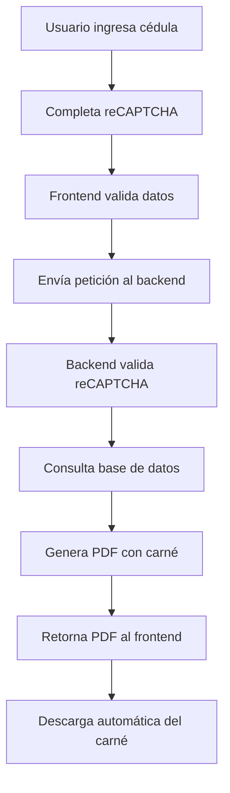
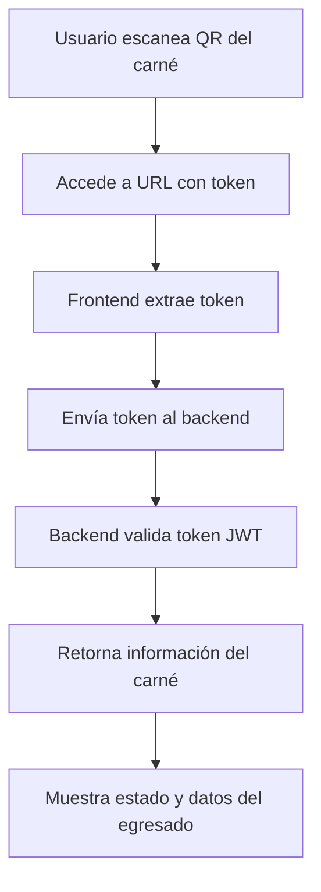

# 🎓 Sistema de Generación de Carné de Egresado - SENA Regional Cauca


## 📋 Tabla de Contenidos

- [Descripción](#-descripción)
- [Características](#-características)
- [Para Qué Sirve](#-para-qué-sirve)
- [Cómo Funciona](#-cómo-funciona)
- [Tecnologías](#-tecnologías)
- [Estructura del Proyecto](#-estructura-del-proyecto)
- [Arquitectura](#-arquitectura)
- [Instalación](#-instalación)
- [Configuración](#-configuración)
- [Uso](#-uso)
- [Scripts Disponibles](#-scripts-disponibles)

## 🎯 Descripción

Sistema web moderno desarrollado para el **SENA Regional Cauca** que permite a los egresados generar y verificar su carné digital de manera segura, rápida y accesible. La aplicación implementa las mejores prácticas de desarrollo frontend con **Next.js 14**, **TypeScript** y **Clean Architecture**, garantizando escalabilidad, mantenibilidad y una excelente experiencia de usuario.

## ✨ Características

### Funcionalidades Principales

- **🔐 Generación Segura de Carnés**: Sistema protegido con Google reCAPTCHA v2 para prevenir abuso y bots
- **✅ Verificación de Carnés**: Sistema de verificación mediante tokens JWT con QR codes
- **📱 Diseño Responsive**: Interfaz adaptable a todos los dispositivos (móviles, tablets, escritorio)
- **🎨 UI Moderna**: Interfaz elegante con Radix UI y TailwindCSS
- **⚡ Alto Rendimiento**: Optimización con Next.js App Router y Server Components
- **🔄 Descarga Directa**: Generación y descarga automática de carnés en formato PDF
- **🌐 Multilenguaje**: Preparado para internacionalización
- **♿ Accesibilidad**: Cumple con estándares WCAG

### Seguridad

- **reCAPTCHA v2**: Protección contra spam y bots maliciosos
- **Validación de Datos**: Verificación en cliente y servidor
- **Tokens JWT**: Autenticación segura para verificación de carnés
- **HTTPS Ready**: Preparado para conexiones seguras

## 🎯 Para Qué Sirve

### Propósito Principal

Esta aplicación resuelve la necesidad de **digitalización y automatización** del proceso de expedición de carnés para egresados del SENA Regional Cauca, permitiendo:

1. **Para Egresados**:
   - Obtener su carné digital de manera instantánea
   - Acceder desde cualquier dispositivo con conexión a internet
   - Verificar la autenticidad de su carné mediante código QR
   - Acceder a beneficios con aliados estratégicos

2. **Para la Institución**:
   - Reducir costos de impresión y distribución física
   - Automatizar el proceso de generación de carnés
   - Mantener un registro digital de carnés emitidos
   - Facilitar la verificación de autenticidad

3. **Para Aliados**:
   - Verificar rápidamente la validez de un carné
   - Confirmar el estado de egresado mediante escaneo de QR
   - Reducir fraude en beneficios otorgados

### Casos de Uso

- ✅ Egresado solicita su carné digital ingresando su cédula
- ✅ Sistema valida identidad y genera PDF con carné personalizado
- ✅ Carné incluye código QR para verificación
- ✅ Aliados escanean QR para validar autenticidad
- ✅ Sistema muestra información del egresado y estado del carné

## 🔄 Cómo Funciona

### Flujo de Generación de Carné



### Flujo de Verificación



### Proceso Técnico

1. **Generación**:
   - Usuario ingresa número de cédula
   - Completa validación reCAPTCHA
   - Frontend envía petición POST a `/carnet` con `cedula` y `recaptchaToken`
   - Backend verifica token con Google
   - Backend consulta datos del egresado
   - Backend genera PDF personalizado con QR code
   - Frontend descarga automáticamente el PDF

2. **Verificación**:
   - Usuario/Aliado escanea código QR
   - Redirige a `/verify/[token]`
   - Frontend envía token al endpoint de verificación
   - Backend valida JWT y retorna información
   - Frontend muestra datos del egresado y estado del carné

## 🛠 Tecnologías

### Frontend Core

- **[Next.js 14](https://nextjs.org/)**: Framework React con App Router y Server Components
- **[React 18](https://react.dev/)**: Biblioteca UI con hooks y composición
- **[TypeScript 5](https://www.typescriptlang.org/)**: Tipado estático para mayor seguridad
- **[TailwindCSS 3.4](https://tailwindcss.com/)**: Framework CSS utility-first

### UI Components & Design

- **[Radix UI](https://www.radix-ui.com/)**: Componentes accesibles y sin estilos
- **[Shadcn/ui](https://ui.shadcn.com/)**: Sistema de componentes basado en Radix
- **[Lucide React](https://lucide.dev/)**: Iconos SVG modernos
- **[Class Variance Authority](https://cva.style/)**: Gestión de variantes de componentes
- **[Tailwind Merge](https://github.com/dcastil/tailwind-merge)**: Combinación inteligente de clases

### State Management & Forms

- **[Zustand](https://zustand-demo.pmnd.rs/)**: State management ligero y eficiente
- **[React Hook Form](https://react-hook-form.com/)**: Gestión de formularios performante
- **[Zod](https://zod.dev/)**: Validación de esquemas TypeScript-first

### HTTP & API

- **[Axios](https://axios-http.com/)**: Cliente HTTP con interceptores
- **[React Google reCAPTCHA](https://www.npmjs.com/package/react-google-recaptcha)**: Integración reCAPTCHA v2

### Development Tools

- **[ESLint](https://eslint.org/)**: Linter para código JavaScript/TypeScript
- **[PostCSS](https://postcss.org/)**: Transformación de CSS
- **[Autoprefixer](https://github.com/postcss/autoprefixer)**: Prefijos CSS automáticos

### Utilities

- **[date-fns](https://date-fns.org/)**: Manipulación de fechas
- **[clsx](https://github.com/lukeed/clsx)**: Construcción condicional de classNames
- **[Sonner](https://sonner.emilkowal.ski/)**: Notificaciones toast elegantes

## 📁 Estructura del Proyecto

```
C-Egresados-Front/
│
├── app/                          # Next.js App Router
│   ├── globals.css              # Estilos globales
│   ├── layout.tsx               # Layout principal
│   ├── page.tsx                 # Página de inicio (generación)
│   └── verify/
│       └── [token]/
│           └── page.tsx         # Página de verificación dinámica
│
├── components/                   # Componentes React
│   ├── carnet-generator-form.tsx    # Formulario de generación
│   ├── partners-section.tsx         # Sección de aliados
│   ├── steps-section.tsx            # Pasos del proceso
│   ├── verification-page.tsx        # Página de verificación
│   ├── theme-provider.tsx           # Provider de tema
│   └── ui/                          # Componentes UI reutilizables
│       ├── button.tsx
│       ├── card.tsx
│       ├── input.tsx
│       ├── alert.tsx
│       ├── badge.tsx
│       └── [30+ componentes más]
│
├── core/                         # Clean Architecture
│   ├── domain/                  # Capa de dominio
│   │   ├── carnet.types.ts     # Tipos e interfaces
│   │   └── carnet.repository.ts # Contratos de repositorio
│   │
│   ├── infrastructure/          # Capa de infraestructura
│   │   └── carnet.repository.impl.ts # Implementación de repositorio
│   │
│   └── useCase/                 # Casos de uso
│       ├── get-carnet.usecase.ts     # Lógica de generación
│       └── verify-carnet.usecase.ts  # Lógica de verificación
│
├── hooks/                        # Custom React Hooks
│   ├── use-carnet.ts            # Hook para generación
│   ├── use-verify-carnet.ts     # Hook para verificación
│   ├── use-mobile.ts            # Hook detección móvil
│   └── use-toast.ts             # Hook notificaciones
│
├── lib/                          # Utilidades y configuraciones
│   ├── utils.ts                 # Funciones auxiliares
│   └── api/
│       └── axios.ts             # Configuración Axios
│
├── store/                        # Zustand State Management
│   ├── carnet.store.ts          # Store de carnés
│   └── verify-carnet.store.ts   # Store de verificación
│
├── public/                       # Archivos estáticos
│   ├── images/                  # Imágenes del sitio
│   └── LOGOS_IES/              # Logos institucionales
│
├── styles/                       # Estilos adicionales
│   └── globals.css
│
├── .env.local                    # Variables de entorno (local)
├── .gitignore                   # Archivos ignorados por Git
├── components.json              # Configuración Shadcn
├── next.config.mjs              # Configuración Next.js
├── package.json                 # Dependencias del proyecto
├── postcss.config.mjs           # Configuración PostCSS
├── tailwind.config.ts           # Configuración TailwindCSS
├── tsconfig.json                # Configuración TypeScript
├── BACKEND_IMPLEMENTATION.md    # Guía de implementación backend
└── RECAPTCHA_SETUP.md          # Guía configuración reCAPTCHA
```

## 🏗 Arquitectura

### Clean Architecture (Hexagonal)

El proyecto implementa **Clean Architecture** para separar responsabilidades y facilitar el mantenimiento:

```
┌─────────────────────────────────────────────────────┐
│                    Presentation                     │
│   (Components, Pages, Hooks)                        │
│   - carnet-generator-form.tsx                       │
│   - verification-page.tsx                           │
│   - use-carnet.ts                                   │
└────────────────┬────────────────────────────────────┘
                 │
┌────────────────▼────────────────────────────────────┐
│                   Use Cases                         │
│   (Business Logic)                                  │
│   - get-carnet.usecase.ts                          │
│   - verify-carnet.usecase.ts                       │
└────────────────┬────────────────────────────────────┘
                 │
┌────────────────▼────────────────────────────────────┐
│                 Domain Layer                        │
│   (Entities, Types, Interfaces)                    │
│   - carnet.types.ts                                │
│   - carnet.repository.ts                           │
└────────────────┬────────────────────────────────────┘
                 │
┌────────────────▼────────────────────────────────────┐
│              Infrastructure                         │
│   (External Services, API Calls)                   │
│   - carnet.repository.impl.ts                      │
│   - axios.ts                                        │
└─────────────────────────────────────────────────────┘
```

### Capas de la Arquitectura

1. **Presentation Layer** (app/, components/, hooks/)
   - Componentes de UI
   - Páginas Next.js
   - Custom hooks para lógica de UI
   - Gestión de estado local

2. **Use Cases Layer** (core/useCase/)
   - Lógica de negocio pura
   - Casos de uso específicos
   - Independiente de framework

3. **Domain Layer** (core/domain/)
   - Entidades del dominio
   - Interfaces y tipos
   - Contratos de repositorios
   - Reglas de negocio

4. **Infrastructure Layer** (core/infrastructure/, lib/api/)
   - Implementación de repositorios
   - Llamadas a APIs externas
   - Servicios de terceros

### Patrones de Diseño

- **Repository Pattern**: Abstracción del acceso a datos
- **Dependency Injection**: Inversión de dependencias
- **Custom Hooks**: Encapsulación de lógica reutilizable
- **Composition Pattern**: Componentes reutilizables y combinables

## 📦 Instalación

### Prerrequisitos

- **Node.js**: >= 18.0.0
- **npm**: >= 9.0.0 o **yarn** >= 1.22.0
- **Git**: Para clonar el repositorio

### Pasos de Instalación

1. **Clonar el repositorio**:
```bash
git clone <url-del-repositorio>
cd C-Egresados-Front
```

2. **Instalar dependencias**:
```bash
npm install
# o
yarn install
```

3. **Configurar variables de entorno**:
```bash
cp .env.example .env.local
```

Edita `.env.local` con tus valores:
```env
# API Backend
NEXT_PUBLIC_API_URL=http://localhost:4000

# Google reCAPTCHA v2
NEXT_PUBLIC_RECAPTCHA_SITE_KEY=tu_site_key_aqui

# Environment
NODE_ENV=development
```

4. **Iniciar servidor de desarrollo**:
```bash
npm run dev
# o
yarn dev
```

5. **Abrir en navegador**:
```
http://localhost:3000
```

## ⚙️ Configuración

### Variables de Entorno

| Variable | Descripción | Ejemplo |
|----------|-------------|---------|
| `NEXT_PUBLIC_API_URL` | URL del backend | `http://localhost:4000` |
| `NEXT_PUBLIC_RECAPTCHA_SITE_KEY` | Clave pública de reCAPTCHA | `6LeIxAcTAAAAAJ...` |
| `NODE_ENV` | Entorno de ejecución | `development`, `production` |

### Configuración de reCAPTCHA

1. Crea una cuenta en [Google reCAPTCHA](https://www.google.com/recaptcha/admin)
2. Registra un nuevo sitio con reCAPTCHA v2 "No soy un robot"
3. Agrega los dominios permitidos:
   - Desarrollo: `localhost`
   - Producción: tu dominio
4. Copia las claves y agrégalas a `.env.local`

Ver guía completa en [RECAPTCHA_SETUP.md](RECAPTCHA_SETUP.md)

### Configuración del Backend

El backend debe exponer los siguientes endpoints:

- **POST** `/carnet` - Generar carné
  - Body: `{ cedula, recaptchaToken }`
  - Response: PDF file

- **POST** `/verify` - Verificar carné
  - Body: `{ token }`
  - Response: `{ valid, carnetInfo }`

Ver guía completa en [BACKEND_IMPLEMENTATION.md](BACKEND_IMPLEMENTATION.md)

## 🚀 Uso

### Generación de Carné

1. Accede a la página principal
2. Ingresa tu número de cédula
3. Completa la verificación reCAPTCHA
4. Haz clic en "Generar Carné"
5. El carné se descargará automáticamente en formato PDF

### Verificación de Carné

1. Escanea el código QR del carné
2. Se abrirá la página de verificación
3. El sistema validará automáticamente el token
4. Se mostrará la información del egresado y el estado del carné

### Componentes Principales

#### CarnetGeneratorForm
```tsx
import { CarnetGeneratorForm } from "@/components/carnet-generator-form"

export default function Page() {
  return <CarnetGeneratorForm />
}
```

#### VerificationPage
```tsx
import { VerificationPage } from "@/components/verification-page"

export default function Page({ params }) {
  return <VerificationPage token={params.token} />
}
```

## 📜 Scripts Disponibles

```bash
# Desarrollo
npm run dev          # Inicia servidor de desarrollo (localhost:3000)

# Producción
npm run build        # Compila la aplicación para producción
npm run start        # Inicia servidor de producción

# Linting
npm run lint         # Ejecuta ESLint para verificar código

# Análisis
npm run analyze      # Analiza el bundle de producción
```

## 🔐 Seguridad

- ✅ Validación de entrada en cliente y servidor
- ✅ Protección reCAPTCHA contra bots
- ✅ Tokens JWT para verificación
- ✅ CORS configurado en backend
- ✅ Sanitización de datos
- ✅ HTTPS en producción

## 📱 Responsive Design

La aplicación está optimizada para:
- 📱 Móviles: 320px - 767px
- 📱 Tablets: 768px - 1023px
- 💻 Desktop: 1024px+
- 🖥️ Large Desktop: 1920px+

## 🌐 Navegadores Soportados

- Chrome/Edge: Últimas 2 versiones
- Firefox: Últimas 2 versiones
- Safari: Últimas 2 versiones
- Opera: Últimas 2 versiones

## 🤝 Contribución

Para contribuir al proyecto:

1. Fork el repositorio
2. Crea una rama feature (`git checkout -b feature/NuevaCaracteristica`)
3. Commit tus cambios (`git commit -m 'Add: Nueva característica'`)
4. Push a la rama (`git push origin feature/NuevaCaracteristica`)
5. Abre un Pull Request

## 📄 Licencia

Este proyecto es propiedad del **SENA Regional Cauca**. Todos los derechos reservados.

## 👥 Equipo

Desarrollado para el **Servicio Nacional de Aprendizaje (SENA) - Regional Cauca**

---

**📞 Soporte**: Para soporte técnico, contacta al área de TI del SENA Regional Cauca

**🔗 Enlaces Útiles**:
- [Documentación Next.js](https://nextjs.org/docs)
- [Documentación React](https://react.dev)
- [Documentación TailwindCSS](https://tailwindcss.com/docs)
- [Shadcn/ui Components](https://ui.shadcn.com)
